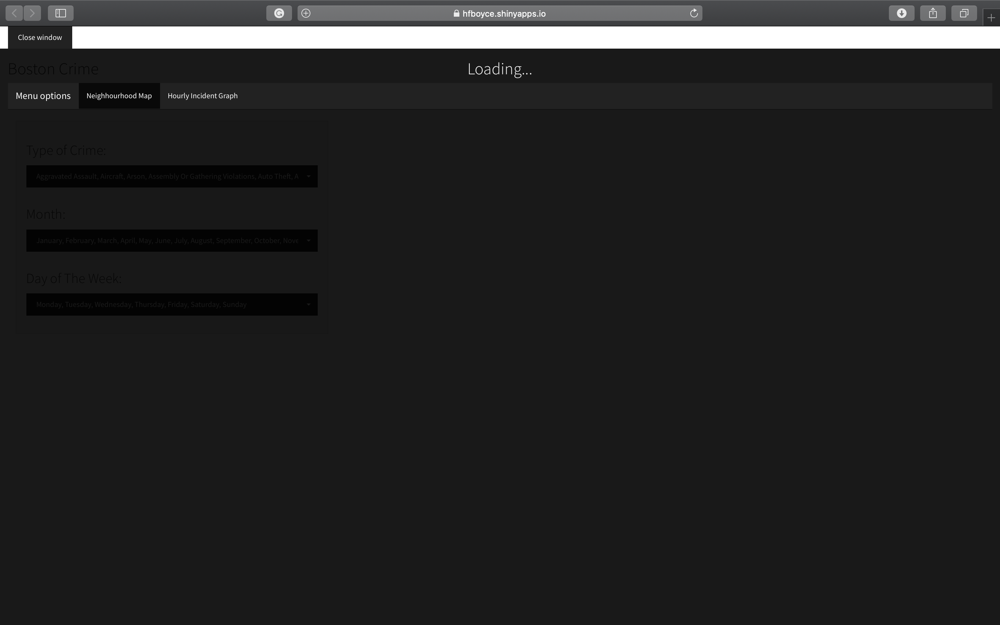
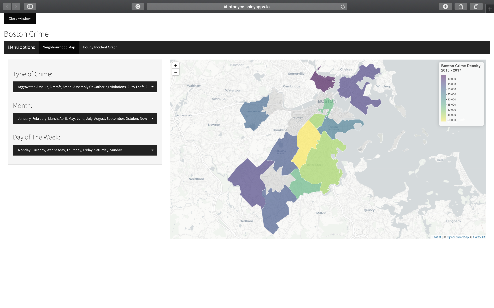
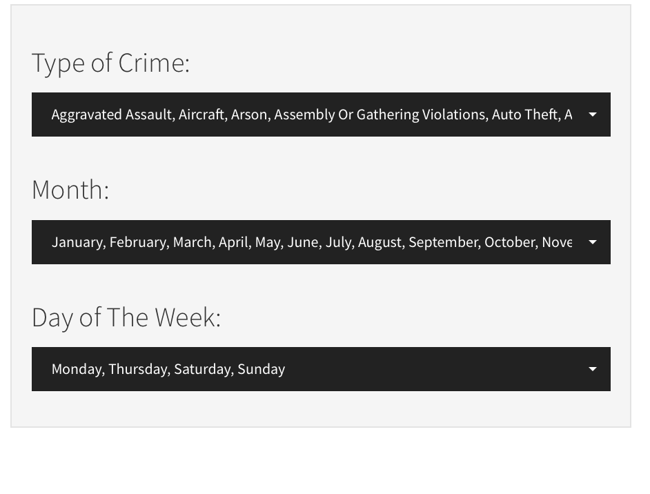
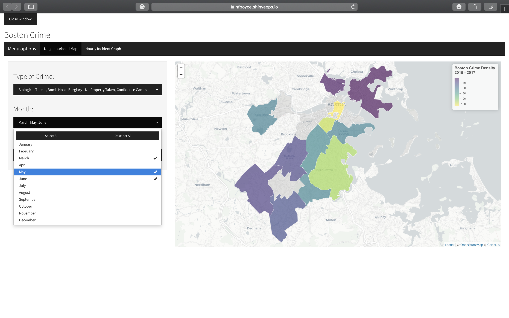
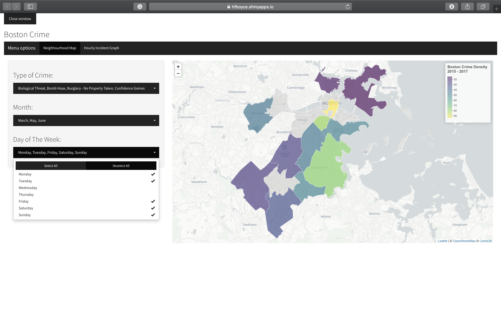
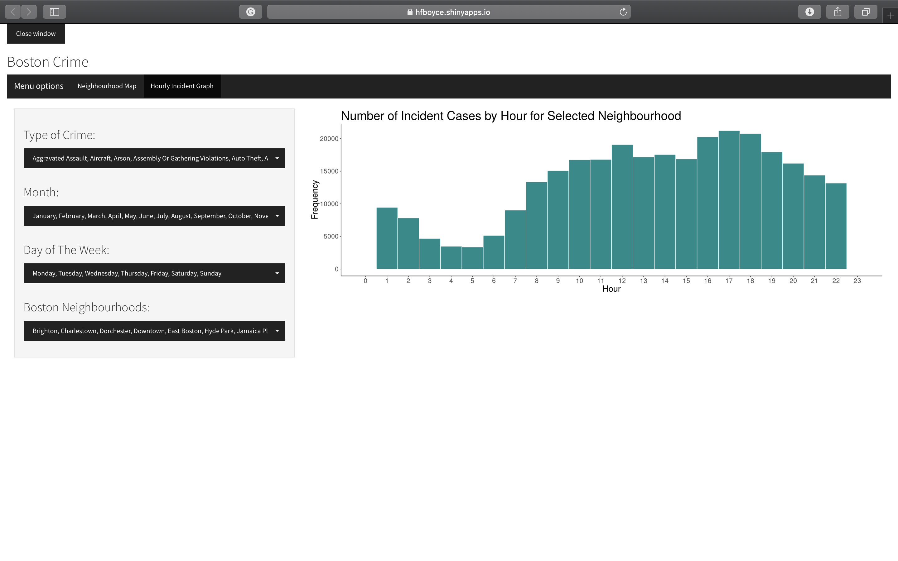
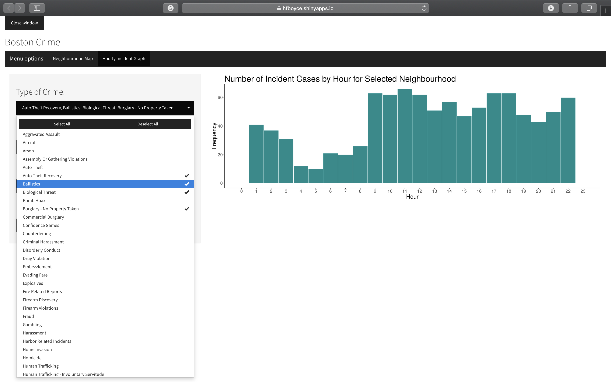
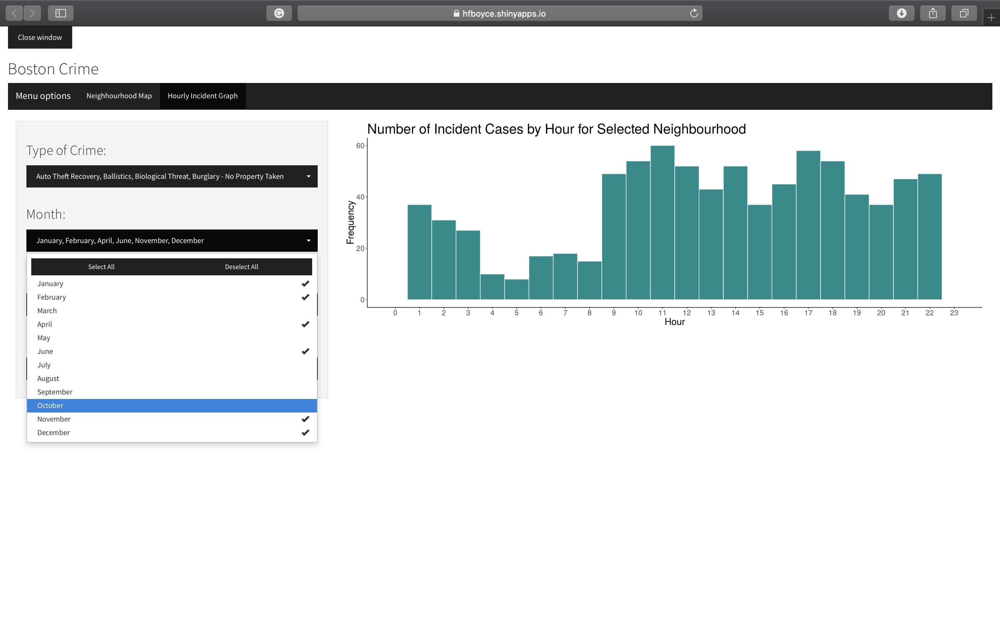
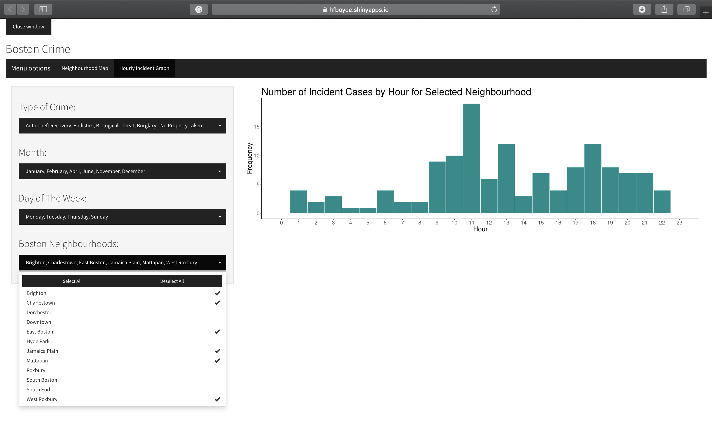
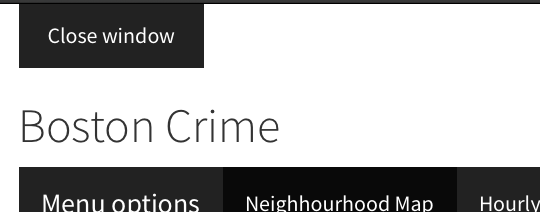

# Milestone 2

## Rationale

Visualizing large amounts of data can often be difficult and confusing.  While we were conceptualizing our application, we decided to use a map because it is very easy to understand and interpret what is going on. By providing the user with some flexibility through filtering and manipulating the data, it allows them to answer specific questions pertaining to crime rates within the municipality of Boston. Leaflet was used to access a base map, and shapefile polygons were layered on top to allow the user to identify Boston’s different district boundaries.  This allows the user to visually compare and contrast the crime frequency by neighbourhood by means of a colour palette. The second tab, “Hourly Incident Graph”, lets the user dig a little deeper in their analysis an see the particular crime frequency per hour of specific neighbourhoods. We used a specific type of select menu for versatility and precision.

## Tasks

Based on our proposal the task in which we attempted to achieve in this Milestone were as followed:

* **Map:**
    * Create a map depicting the frequency of crimes in given Boston neighbourhoods.
    * Layer the shapefiles with a leaflet base map to outline the districts clearly.
    * Create a filtration mechanism so the user can pick and choose based on crime type
    * Have the districts reflect the frequency of a selected crime(s) by means of colour.

* **Build Graph:**
    * Create a plot that shows the user the frequency (histogram) of crime occurring during the selected months, in the specified neighbourhoods.

* **Multi-select filtering:**    
    * After getting feedback from our TA, we agreed with his suggest to have multi-selection options for the type of crime. This prove, slightly more difficult than anticipated however all filtering of the data is in perfect working order.

## Functionality 

Often opening the shiny apps can take a bit of time so we added convinient feature that shows the page is loading, so it limits the users potential frustration. 

Once The page is loaded the user will see this landing page.
      

The app has a navigation bar to select the type of visualization whether it be the main page displaying the map or the second tab displaying a graph
      

Below are the multiple ways of filtering the data of the map using the different types of crime, the month, and the day of the week. 
      

  

Following The filtering of the map you will see the colours of the neighbourhoods change and the legend adjusts to the new scale of crimes. 

Moving onto the second tab labelled "Hourly Incident Graph", you get to this landing page.

 

This tab has a similar functionality, however now you there is an additional function to filter by any particular neighbourhoods. 

  

To finish your session you can close your session using the "Close Window" in the top left side of the screen. 

## Vision & Next Steps

Our next goal is to implement a hover component. This means that a user will be able to scan with their mouse over a given district to tease out specific information pertaining to that district.  We want the hover feature to output the name of the neighbourhood, the values of the selected filtering incidents and how they rank in comparison to other neighbourhoods.

Navigation could be an issue as the tabs are quite small and unclear.  For milestone 3, we will likely explore this feature further in order to improve it such that it is more user friendly.

Having the single graph on the second tab seems quite lonely.  Potentially adding more descriptive statistics or some tabular data be of help to the user as they attempt to answer their questions.

Currently all of the selection features on the sidebar are the same. This was initially thought out in the design phase for flexibility, however, we believe that we can improve on these features to make the app more user friendly.

In addition to these goals, we believe there is still a lot of work to do on the formatting on the minor detail to improve the overall experience. Text fonts and sizes, as well as sidebar and main panel colours.  These issues will be addressed in the next milestone.  

## Bugs

* Currently, when you deselect every feature on a filter, an error is displayed in the main panel and no map is outputted. An empty graph is displayed when no selection is chosen for any of the features. We are hoping to add a mandatory “at least one” function to prohibit an empty selection on a filter.
* We have added a “close window feature” which will close the app however not the window. I believe this could be a browser issue. Fixing this or removing this feature will be on the task list for milestone 3.

## Ammendments

Our app design has definitely changed since our proposal. We have added multi-select filtering for all of our filtering options and took out "day" filtering. This was due to the fact that our data was not conducive to such precise selections. We decided on adding two tabs. We felt that having an additional selection for "neighbourhood" on the same panel as the map was a little confusing since this filter will not affect the map and only the graph.  Our app does not include the hover features yet as we said in our proposal but we are hoping to implement this in the next milestone.